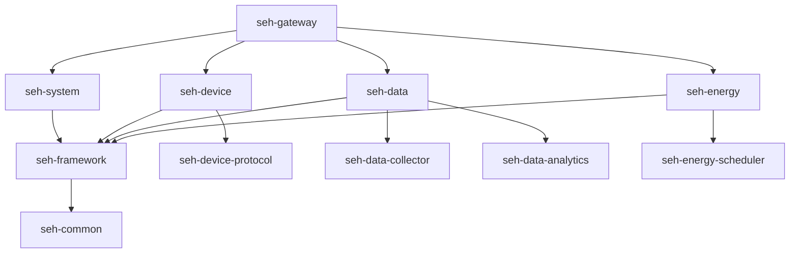
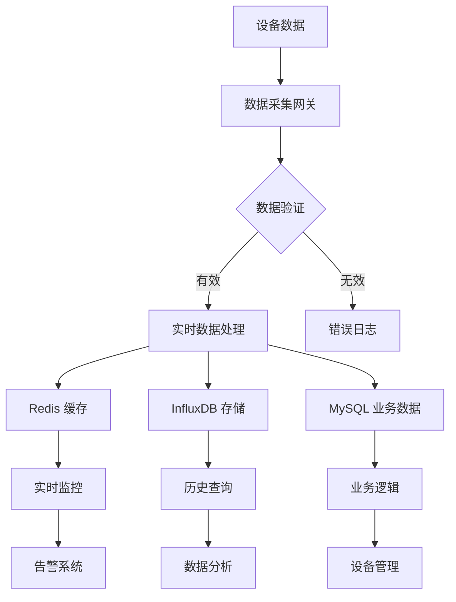
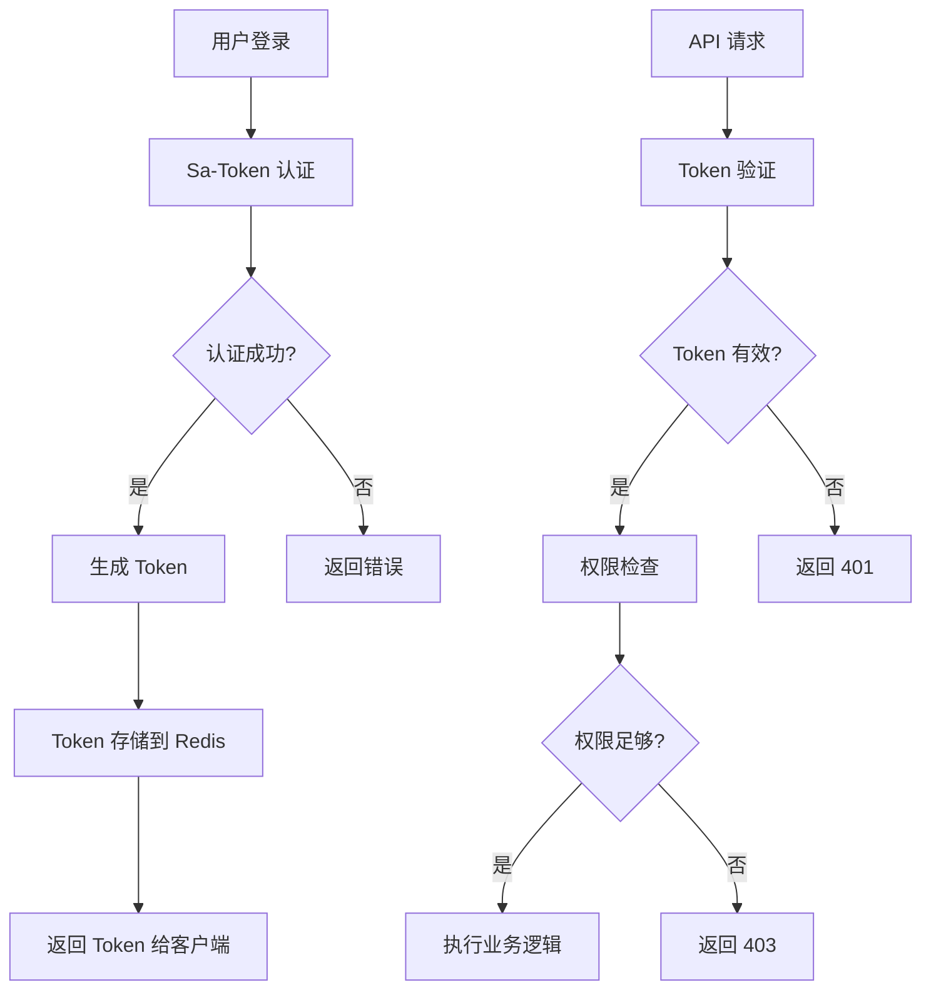
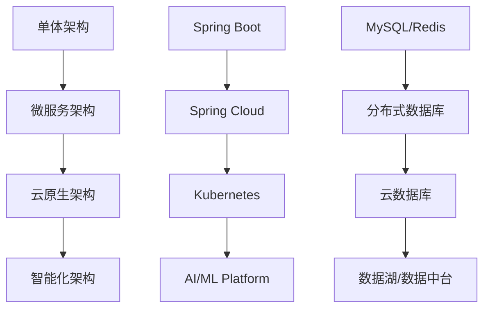

# Smart Energy Hub 架构设计文档

## 📋 概述

本文档详细描述了 Smart Energy Hub 项目的系统架构设计，包括技术选型、模块划分、数据流向、接口设计等核心内容。

## 🎯 设计目标

### 核心目标
- **高性能**: 支持大量设备并发数据处理
- **高可用**: 99.9% 系统可用性保证
- **可扩展**: 支持水平扩展和垂直扩展
- **易维护**: 模块化设计，便于开发和维护
- **安全性**: 完善的权限控制和数据安全

### 非功能性需求
- **并发处理**: 支持 10,000+ 设备同时在线
- **响应时间**: API 响应时间 < 200ms
- **数据吞吐**: 支持每秒 10,000+ 条数据写入
- **存储容量**: 支持 TB 级数据存储
- **可用性**: 7×24 小时不间断服务

## 🏗️ 系统架构

### 整体架构图

```
┌─────────────────────────────────────────────────────────────────┐
│                        客户端层 (Client Layer)                    │
├─────────────────┬─────────────────┬─────────────────────────────┤
│   Web Browser   │   Mobile App    │      Third-party API        │
└─────────────────┴─────────────────┴─────────────────────────────┘
                                │
                                ▼
┌─────────────────────────────────────────────────────────────────┐
│                      接入层 (Gateway Layer)                      │
├─────────────────┬─────────────────┬─────────────────────────────┤
│   Load Balancer │      Nginx      │         API Gateway         │
│    (HAProxy)    │   (Static Web)  │      (Rate Limiting)        │
└─────────────────┴─────────────────┴─────────────────────────────┘
                                │
                                ▼
┌─────────────────────────────────────────────────────────────────┐
│                      应用层 (Application Layer)                   │
├─────────────────┬─────────────────┬─────────────────────────────┤
│  Web Controller │  Device Manager │      Data Processor         │
│   (REST API)    │   (MQTT/HTTP)   │    (Real-time Analysis)     │
└─────────────────┴─────────────────┴─────────────────────────────┘
                                │
                                ▼
┌─────────────────────────────────────────────────────────────────┐
│                      服务层 (Service Layer)                      │
├─────────────────┬─────────────────┬─────────────────────────────┤
│  Device Service │   Data Service  │      Analytics Service      │
│  User Service   │  Alert Service  │      Scheduler Service      │
└─────────────────┴─────────────────┴─────────────────────────────┘
                                │
                                ▼
┌─────────────────────────────────────────────────────────────────┐
│                      数据层 (Data Layer)                         │
├─────────────────┬─────────────────┬─────────────────────────────┤
│     MySQL       │      Redis      │       Time Series DB       │
│  (Master/Slave) │    (Cache)      │      (InfluxDB/TDengine)    │
└─────────────────┴─────────────────┴─────────────────────────────┘
```

### 技术架构栈

```
┌─────────────────────────────────────────────────────────────────┐
│                          前端技术栈                              │
├─────────────────┬─────────────────┬─────────────────────────────┤
│     Vue.js 3    │    TypeScript   │         Element Plus        │
│     Vite        │      Pinia      │           ECharts           │
└─────────────────┴─────────────────┴─────────────────────────────┘

┌─────────────────────────────────────────────────────────────────┐
│                          后端技术栈                              │
├─────────────────┬─────────────────┬─────────────────────────────┤
│   Spring Boot   │   Spring MVC    │       Spring Security       │
│  MyBatis-Plus   │    Sa-Token     │         Swagger 3           │
│     Lombok      │    Validation   │          Jackson            │
└─────────────────┴─────────────────┴─────────────────────────────┘

┌─────────────────────────────────────────────────────────────────┐
│                          数据技术栈                              │
├─────────────────┬─────────────────┬─────────────────────────────┤
│     MySQL 8     │     Redis 7     │         InfluxDB            │
│   HikariCP      │   Redisson      │          Flyway             │
└─────────────────┴─────────────────┴─────────────────────────────┘

┌─────────────────────────────────────────────────────────────────┐
│                        基础设施技术栈                             │
├─────────────────┬─────────────────┬─────────────────────────────┤
│     Docker      │   Kubernetes    │         Prometheus          │
│     Nginx       │      ELK        │           Grafana           │
└─────────────────┴─────────────────┴─────────────────────────────┘
```

## 🧩 模块设计

### 核心模块划分

```
smart-energy-hub/
├── seh-common/              # 公共模块
│   ├── seh-common-core/      # 核心工具类
│   ├── seh-common-security/  # 安全组件
│   ├── seh-common-redis/     # Redis 组件
│   └── seh-common-swagger/   # API 文档组件
├── seh-framework/           # 框架模块
│   ├── seh-spring-boot-starter/ # 自动配置
│   └── seh-web/             # Web 框架封装
├── seh-system/              # 系统管理模块
│   ├── seh-system-api/      # 系统 API
│   └── seh-system-biz/      # 系统业务逻辑
├── seh-device/              # 设备管理模块
│   ├── seh-device-api/      # 设备 API
│   ├── seh-device-biz/      # 设备业务逻辑
│   └── seh-device-protocol/ # 设备协议
├── seh-data/                # 数据处理模块
│   ├── seh-data-api/        # 数据 API
│   ├── seh-data-biz/        # 数据业务逻辑
│   ├── seh-data-collector/  # 数据采集
│   └── seh-data-analytics/  # 数据分析
├── seh-energy/              # 能源管理模块
│   ├── seh-energy-api/      # 能源 API
│   ├── seh-energy-biz/      # 能源业务逻辑
│   └── seh-energy-scheduler/ # 能源调度
└── seh-gateway/             # 网关模块
    ├── seh-gateway-web/     # Web 网关
    └── seh-gateway-device/  # 设备网关
```

### 模块依赖关系



## 📊 数据架构

### 数据库设计

#### 主数据库 (MySQL)

**核心业务表**:
```sql
-- 设备信息表
CREATE TABLE device_info (
    id BIGINT PRIMARY KEY AUTO_INCREMENT,
    device_code VARCHAR(50) UNIQUE NOT NULL COMMENT '设备编码',
    device_name VARCHAR(100) NOT NULL COMMENT '设备名称',
    device_type ENUM('PUMP', 'LIGHTING', 'SENSOR') NOT NULL COMMENT '设备类型',
    region_id BIGINT NOT NULL COMMENT '区域ID',
    online_status TINYINT DEFAULT 0 COMMENT '在线状态',
    work_status TINYINT DEFAULT 0 COMMENT '工作状态',
    alarm_status TINYINT DEFAULT 0 COMMENT '告警状态',
    last_online_time DATETIME COMMENT '最后在线时间',
    created_time DATETIME DEFAULT CURRENT_TIMESTAMP,
    updated_time DATETIME DEFAULT CURRENT_TIMESTAMP ON UPDATE CURRENT_TIMESTAMP,
    INDEX idx_device_type (device_type),
    INDEX idx_region_id (region_id),
    INDEX idx_online_status (online_status)
) COMMENT '设备信息表';

-- 区域信息表
CREATE TABLE region_info (
    id BIGINT PRIMARY KEY AUTO_INCREMENT,
    region_code VARCHAR(50) UNIQUE NOT NULL COMMENT '区域编码',
    region_name VARCHAR(100) NOT NULL COMMENT '区域名称',
    parent_id BIGINT DEFAULT 0 COMMENT '父区域ID',
    region_level TINYINT NOT NULL COMMENT '区域层级',
    sort_order INT DEFAULT 0 COMMENT '排序',
    status TINYINT DEFAULT 1 COMMENT '状态',
    created_time DATETIME DEFAULT CURRENT_TIMESTAMP,
    updated_time DATETIME DEFAULT CURRENT_TIMESTAMP ON UPDATE CURRENT_TIMESTAMP,
    INDEX idx_parent_id (parent_id),
    INDEX idx_region_level (region_level)
) COMMENT '区域信息表';

-- 用户信息表
CREATE TABLE user_info (
    id BIGINT PRIMARY KEY AUTO_INCREMENT,
    username VARCHAR(50) UNIQUE NOT NULL COMMENT '用户名',
    password VARCHAR(100) NOT NULL COMMENT '密码',
    real_name VARCHAR(50) COMMENT '真实姓名',
    email VARCHAR(100) COMMENT '邮箱',
    phone VARCHAR(20) COMMENT '手机号',
    status TINYINT DEFAULT 1 COMMENT '状态',
    last_login_time DATETIME COMMENT '最后登录时间',
    created_time DATETIME DEFAULT CURRENT_TIMESTAMP,
    updated_time DATETIME DEFAULT CURRENT_TIMESTAMP ON UPDATE CURRENT_TIMESTAMP,
    INDEX idx_username (username),
    INDEX idx_status (status)
) COMMENT '用户信息表';
```

**监控数据表**:
```sql
-- 流量监控表
CREATE TABLE flow_monitor (
    id BIGINT PRIMARY KEY AUTO_INCREMENT,
    device_id BIGINT NOT NULL COMMENT '设备ID',
    instant_flow DECIMAL(10,2) COMMENT '瞬时流量',
    total_flow DECIMAL(15,2) COMMENT '累计流量',
    flow_velocity DECIMAL(8,2) COMMENT '流速',
    temperature DECIMAL(6,2) COMMENT '温度',
    pressure DECIMAL(8,3) COMMENT '压力',
    data_quality ENUM('GOOD', 'BAD', 'UNCERTAIN') DEFAULT 'GOOD' COMMENT '数据质量',
    monitor_time DATETIME NOT NULL COMMENT '监测时间',
    created_time DATETIME DEFAULT CURRENT_TIMESTAMP,
    INDEX idx_device_time (device_id, monitor_time),
    INDEX idx_monitor_time (monitor_time)
) COMMENT '流量监控表';

-- 液位监控表
CREATE TABLE level_monitor (
    id BIGINT PRIMARY KEY AUTO_INCREMENT,
    device_id BIGINT NOT NULL COMMENT '设备ID',
    current_level DECIMAL(8,2) COMMENT '当前液位',
    max_level DECIMAL(8,2) COMMENT '最大液位',
    level_percent DECIMAL(5,2) COMMENT '液位百分比',
    volume DECIMAL(12,2) COMMENT '体积',
    temperature DECIMAL(6,2) COMMENT '温度',
    density DECIMAL(6,3) COMMENT '密度',
    alarm_status ENUM('NORMAL', 'LOW', 'HIGH', 'CRITICAL') DEFAULT 'NORMAL' COMMENT '告警状态',
    monitor_time DATETIME NOT NULL COMMENT '监测时间',
    created_time DATETIME DEFAULT CURRENT_TIMESTAMP,
    INDEX idx_device_time (device_id, monitor_time),
    INDEX idx_monitor_time (monitor_time)
) COMMENT '液位监控表';
```

#### 缓存数据库 (Redis)

**缓存策略**:
```
# 设备状态缓存 (TTL: 5分钟)
device:status:{deviceId} -> {
    "onlineStatus": 1,
    "workStatus": 1,
    "alarmStatus": 0,
    "lastUpdateTime": "2025-06-25 10:00:00"
}

# 实时数据缓存 (TTL: 1分钟)
device:realtime:{deviceId} -> {
    "instantFlow": 125.5,
    "currentLevel": 3.2,
    "temperature": 22.5,
    "timestamp": "2025-06-25 10:00:00"
}

# 用户会话缓存 (TTL: 2小时)
user:session:{token} -> {
    "userId": 1,
    "username": "admin",
    "permissions": ["device:read", "data:read"]
}

# API 限流缓存 (TTL: 1分钟)
api:ratelimit:{ip}:{endpoint} -> count

# 统计数据缓存 (TTL: 10分钟)
stats:device:count -> {
    "total": 100,
    "online": 95,
    "offline": 5,
    "alarm": 3
}
```

#### 时序数据库 (InfluxDB)

**数据模型**:
```
# 设备监控数据
measurement: device_metrics
tags:
  - device_id
  - device_type
  - region_id
fields:
  - instant_flow (float)
  - total_flow (float)
  - current_level (float)
  - temperature (float)
  - pressure (float)
  - online_status (integer)
  - work_status (integer)
timestamp: RFC3339

# 能耗数据
measurement: energy_consumption
tags:
  - device_id
  - energy_type
  - region_id
fields:
  - power_consumption (float)
  - energy_efficiency (float)
  - cost (float)
timestamp: RFC3339
```

### 数据流向



## 🔌 接口设计

### RESTful API 设计原则

**URL 设计规范**:
```
# 资源命名
GET    /api/devices              # 获取设备列表
GET    /api/devices/{id}         # 获取设备详情
POST   /api/devices              # 创建设备
PUT    /api/devices/{id}         # 更新设备
DELETE /api/devices/{id}         # 删除设备

# 子资源
GET    /api/devices/{id}/data    # 获取设备数据
POST   /api/devices/{id}/control # 控制设备

# 查询参数
GET    /api/devices?page=1&size=10&type=PUMP&region=1
```

**响应格式标准**:
```json
{
  "code": 200,
  "msg": "success",
  "data": {
    "records": [],
    "total": 100,
    "current": 1,
    "pages": 10
  },
  "timestamp": "2025-06-25T10:00:00Z"
}
```

### 设备协议接口

**MQTT 协议**:
```
# 主题结构
seh/{region_id}/{device_type}/{device_id}/{data_type}

# 示例
seh/1/pump/001/data          # 设备数据上报
seh/1/pump/001/status        # 设备状态上报
seh/1/pump/001/alarm         # 设备告警上报
seh/1/pump/001/control       # 设备控制指令

# 数据格式
{
  "deviceId": "001",
  "timestamp": "2025-06-25T10:00:00Z",
  "data": {
    "instantFlow": 125.5,
    "totalFlow": 1250.8,
    "temperature": 22.5,
    "pressure": 0.45
  }
}
```

**HTTP 协议**:
```http
POST /api/device/data
Content-Type: application/json
Authorization: Device {device_token}

{
  "deviceId": "PUMP_001",
  "timestamp": "2025-06-25T10:00:00Z",
  "metrics": [
    {
      "name": "instant_flow",
      "value": 125.5,
      "unit": "L/min"
    },
    {
      "name": "temperature",
      "value": 22.5,
      "unit": "°C"
    }
  ]
}
```

## 🔐 安全架构

### 认证授权体系



### 权限模型

**RBAC 权限模型**:
```
用户 (User) ←→ 角色 (Role) ←→ 权限 (Permission)

# 权限定义
device:read          # 设备查看
device:write         # 设备操作
device:delete        # 设备删除
data:read            # 数据查看
data:export          # 数据导出
system:admin         # 系统管理

# 角色定义
ADMIN               # 系统管理员 (所有权限)
OPERATOR            # 操作员 (设备操作权限)
VIEWER              # 查看者 (只读权限)
GUEST               # 访客 (基础查看权限)
```

### 数据安全

**敏感数据加密**:
```java
// 数据库密码加密
@Component
public class PasswordEncoder {
    public String encode(String password) {
        return BCrypt.hashpw(password, BCrypt.gensalt());
    }
    
    public boolean matches(String password, String encoded) {
        return BCrypt.checkpw(password, encoded);
    }
}

// 敏感字段加密
@Entity
public class UserInfo {
    @Encrypted
    private String phone;
    
    @Encrypted
    private String email;
}
```

**API 安全防护**:
```java
// 限流配置
@RateLimiter(value = 100, window = 60) // 每分钟100次
public class DeviceController {
    
    @PostMapping("/devices")
    @PreAuthorize("hasPermission('device:write')")
    public Result createDevice(@Valid @RequestBody DeviceCreateRequest request) {
        // 业务逻辑
    }
}

// XSS 防护
@Component
public class XssFilter implements Filter {
    @Override
    public void doFilter(ServletRequest request, ServletResponse response, FilterChain chain) {
        HttpServletRequest httpRequest = (HttpServletRequest) request;
        XssHttpServletRequestWrapper wrapper = new XssHttpServletRequestWrapper(httpRequest);
        chain.doFilter(wrapper, response);
    }
}
```

## ⚡ 性能优化

### 缓存策略

**多级缓存架构**:
```
L1: 本地缓存 (Caffeine)
├── 热点数据缓存 (1000条, TTL: 5分钟)
└── 配置数据缓存 (100条, TTL: 30分钟)

L2: 分布式缓存 (Redis)
├── 用户会话缓存 (TTL: 2小时)
├── 设备状态缓存 (TTL: 5分钟)
├── 实时数据缓存 (TTL: 1分钟)
└── 查询结果缓存 (TTL: 10分钟)

L3: 数据库查询优化
├── 索引优化
├── 查询优化
└── 连接池优化
```

**缓存更新策略**:
```java
@Service
public class DeviceService {
    
    @Cacheable(value = "device", key = "#id")
    public Device getDevice(Long id) {
        return deviceMapper.selectById(id);
    }
    
    @CacheEvict(value = "device", key = "#device.id")
    public void updateDevice(Device device) {
        deviceMapper.updateById(device);
        // 同步更新 Redis
        redisTemplate.opsForValue().set(
            "device:" + device.getId(), 
            device, 
            Duration.ofMinutes(5)
        );
    }
}
```

### 数据库优化

**分库分表策略**:
```sql
-- 按设备类型分表
CREATE TABLE flow_monitor_pump LIKE flow_monitor;
CREATE TABLE flow_monitor_lighting LIKE flow_monitor;
CREATE TABLE flow_monitor_sensor LIKE flow_monitor;

-- 按时间分表 (月表)
CREATE TABLE flow_monitor_202506 LIKE flow_monitor;
CREATE TABLE flow_monitor_202507 LIKE flow_monitor;

-- 分表路由规则
@Component
public class TableShardingAlgorithm {
    public String getTableName(String logicTable, String deviceType, Date date) {
        String suffix = deviceType.toLowerCase() + "_" + 
                       DateUtil.format(date, "yyyyMM");
        return logicTable + "_" + suffix;
    }
}
```

**索引优化**:
```sql
-- 复合索引
CREATE INDEX idx_device_time_type ON flow_monitor (device_id, monitor_time, device_type);

-- 覆盖索引
CREATE INDEX idx_device_flow_cover ON flow_monitor (device_id, monitor_time) 
INCLUDE (instant_flow, total_flow, temperature);

-- 分区索引
ALTER TABLE flow_monitor PARTITION BY RANGE (YEAR(monitor_time)) (
    PARTITION p2024 VALUES LESS THAN (2025),
    PARTITION p2025 VALUES LESS THAN (2026),
    PARTITION p2026 VALUES LESS THAN (2027)
);
```

### 异步处理

**消息队列架构**:
```java
// 异步数据处理
@Component
public class DataProcessor {
    
    @Async("dataProcessorExecutor")
    @EventListener
    public void handleDeviceData(DeviceDataEvent event) {
        // 数据验证
        validateData(event.getData());
        
        // 数据存储
        saveToDatabase(event.getData());
        
        // 实时分析
        analyzeData(event.getData());
        
        // 告警检查
        checkAlarms(event.getData());
    }
}

// 线程池配置
@Configuration
@EnableAsync
public class AsyncConfig {
    
    @Bean("dataProcessorExecutor")
    public Executor dataProcessorExecutor() {
        ThreadPoolTaskExecutor executor = new ThreadPoolTaskExecutor();
        executor.setCorePoolSize(10);
        executor.setMaxPoolSize(20);
        executor.setQueueCapacity(1000);
        executor.setThreadNamePrefix("DataProcessor-");
        executor.setRejectedExecutionHandler(new ThreadPoolExecutor.CallerRunsPolicy());
        return executor;
    }
}
```

## 📊 监控体系

### 应用监控

**指标收集**:
```java
// 自定义指标
@Component
public class MetricsCollector {
    
    private final MeterRegistry meterRegistry;
    private final Counter deviceDataCounter;
    private final Timer apiResponseTimer;
    
    public MetricsCollector(MeterRegistry meterRegistry) {
        this.meterRegistry = meterRegistry;
        this.deviceDataCounter = Counter.builder("device.data.received")
            .description("Number of device data received")
            .register(meterRegistry);
        this.apiResponseTimer = Timer.builder("api.response.time")
            .description("API response time")
            .register(meterRegistry);
    }
    
    public void recordDeviceData(String deviceType) {
        deviceDataCounter.increment(Tags.of("type", deviceType));
    }
    
    public void recordApiResponse(String endpoint, Duration duration) {
        apiResponseTimer.record(duration, Tags.of("endpoint", endpoint));
    }
}
```

**健康检查**:
```java
@Component
public class CustomHealthIndicator implements HealthIndicator {
    
    @Override
    public Health health() {
        // 检查数据库连接
        if (!isDatabaseHealthy()) {
            return Health.down()
                .withDetail("database", "Connection failed")
                .build();
        }
        
        // 检查 Redis 连接
        if (!isRedisHealthy()) {
            return Health.down()
                .withDetail("redis", "Connection failed")
                .build();
        }
        
        // 检查设备连接数
        long deviceCount = getOnlineDeviceCount();
        return Health.up()
            .withDetail("database", "OK")
            .withDetail("redis", "OK")
            .withDetail("onlineDevices", deviceCount)
            .build();
    }
}
```

### 日志体系

**日志配置**:
```xml
<!-- logback-spring.xml -->
<configuration>
    <!-- 控制台输出 -->
    <appender name="CONSOLE" class="ch.qos.logback.core.ConsoleAppender">
        <encoder class="net.logstash.logback.encoder.LoggingEventCompositeJsonEncoder">
            <providers>
                <timestamp/>
                <logLevel/>
                <loggerName/>
                <message/>
                <mdc/>
                <stackTrace/>
            </providers>
        </encoder>
    </appender>
    
    <!-- 文件输出 -->
    <appender name="FILE" class="ch.qos.logback.core.rolling.RollingFileAppender">
        <file>logs/seh.log</file>
        <rollingPolicy class="ch.qos.logback.core.rolling.TimeBasedRollingPolicy">
            <fileNamePattern>logs/seh.%d{yyyy-MM-dd}.%i.log.gz</fileNamePattern>
            <maxFileSize>100MB</maxFileSize>
            <maxHistory>30</maxHistory>
            <totalSizeCap>10GB</totalSizeCap>
        </rollingPolicy>
        <encoder class="net.logstash.logback.encoder.LoggingEventCompositeJsonEncoder">
            <providers>
                <timestamp/>
                <logLevel/>
                <loggerName/>
                <message/>
                <mdc/>
                <stackTrace/>
            </providers>
        </encoder>
    </appender>
    
    <root level="INFO">
        <appender-ref ref="CONSOLE"/>
        <appender-ref ref="FILE"/>
    </root>
</configuration>
```

**链路追踪**:
```java
@Component
public class TraceFilter implements Filter {
    
    @Override
    public void doFilter(ServletRequest request, ServletResponse response, FilterChain chain) {
        String traceId = UUID.randomUUID().toString().replace("-", "");
        MDC.put("traceId", traceId);
        
        try {
            chain.doFilter(request, response);
        } finally {
            MDC.clear();
        }
    }
}
```

## 🚀 扩展性设计

### 微服务拆分

**服务拆分策略**:
```
# 按业务域拆分
seh-user-service          # 用户服务
seh-device-service        # 设备服务
seh-data-service          # 数据服务
seh-energy-service        # 能源服务
seh-notification-service  # 通知服务
seh-gateway-service       # 网关服务

# 按技术职责拆分
seh-config-service        # 配置中心
seh-registry-service      # 服务注册中心
seh-monitor-service       # 监控服务
seh-log-service          # 日志服务
```

**服务通信**:
```java
// 服务间调用
@FeignClient(name = "device-service")
public interface DeviceServiceClient {
    
    @GetMapping("/api/devices/{id}")
    Result<Device> getDevice(@PathVariable Long id);
    
    @PostMapping("/api/devices/{id}/control")
    Result<Void> controlDevice(@PathVariable Long id, @RequestBody ControlCommand command);
}

// 异步消息通信
@Component
public class DeviceEventPublisher {
    
    @Autowired
    private RabbitTemplate rabbitTemplate;
    
    public void publishDeviceStatusChange(DeviceStatusChangeEvent event) {
        rabbitTemplate.convertAndSend(
            "device.exchange", 
            "device.status.changed", 
            event
        );
    }
}
```

### 插件化架构

**设备协议插件**:
```java
// 协议插件接口
public interface DeviceProtocolPlugin {
    String getProtocolName();
    boolean supports(String deviceType);
    DeviceData parseData(byte[] rawData);
    byte[] encodeCommand(ControlCommand command);
}

// 协议插件管理器
@Component
public class ProtocolPluginManager {
    
    private final Map<String, DeviceProtocolPlugin> plugins = new HashMap<>();
    
    @PostConstruct
    public void loadPlugins() {
        // 扫描并加载协议插件
        ServiceLoader<DeviceProtocolPlugin> loader = 
            ServiceLoader.load(DeviceProtocolPlugin.class);
        
        for (DeviceProtocolPlugin plugin : loader) {
            plugins.put(plugin.getProtocolName(), plugin);
        }
    }
    
    public DeviceProtocolPlugin getPlugin(String protocolName) {
        return plugins.get(protocolName);
    }
}
```

## 📈 容量规划

### 性能指标

| 指标 | 目标值 | 监控方式 |
|------|--------|----------|
| API 响应时间 | < 200ms | Prometheus + Grafana |
| 数据库连接数 | < 80% | MySQL 监控 |
| 内存使用率 | < 80% | JVM 监控 |
| CPU 使用率 | < 70% | 系统监控 |
| 磁盘使用率 | < 85% | 系统监控 |
| 网络带宽 | < 80% | 网络监控 |

### 扩容策略

**水平扩容**:
```yaml
# Kubernetes 自动扩容配置
apiVersion: autoscaling/v2
kind: HorizontalPodAutoscaler
metadata:
  name: seh-app-hpa
spec:
  scaleTargetRef:
    apiVersion: apps/v1
    kind: Deployment
    name: seh-app
  minReplicas: 2
  maxReplicas: 10
  metrics:
  - type: Resource
    resource:
      name: cpu
      target:
        type: Utilization
        averageUtilization: 70
  - type: Resource
    resource:
      name: memory
      target:
        type: Utilization
        averageUtilization: 80
```

**垂直扩容**:
```yaml
# 资源配置
resources:
  requests:
    memory: "1Gi"
    cpu: "500m"
  limits:
    memory: "2Gi"
    cpu: "1000m"
```

## 🔄 演进路线

### 技术演进

**Phase 1: 单体应用** (当前)
- Spring Boot 单体架构
- MySQL + Redis 数据存储
- 基础监控和日志

**Phase 2: 服务化改造** (6个月内)
- 微服务拆分
- 服务注册与发现
- 配置中心
- API 网关

**Phase 3: 云原生** (12个月内)
- Kubernetes 部署
- 服务网格 (Istio)
- 可观测性平台
- DevOps 流水线

**Phase 4: 智能化** (18个月内)
- AI/ML 数据分析
- 智能告警
- 自动化运维
- 边缘计算

### 架构演进



---

## 📞 技术支持

- **架构讨论**: [GitHub Discussions](https://github.com/your-username/smart-energy-hub/discussions)
- **技术问题**: [GitHub Issues](https://github.com/your-username/smart-energy-hub/issues)
- **架构评审**: architecture@yourdomain.com

---

**注意**: 本架构文档会随着项目发展持续更新，请关注版本变更。