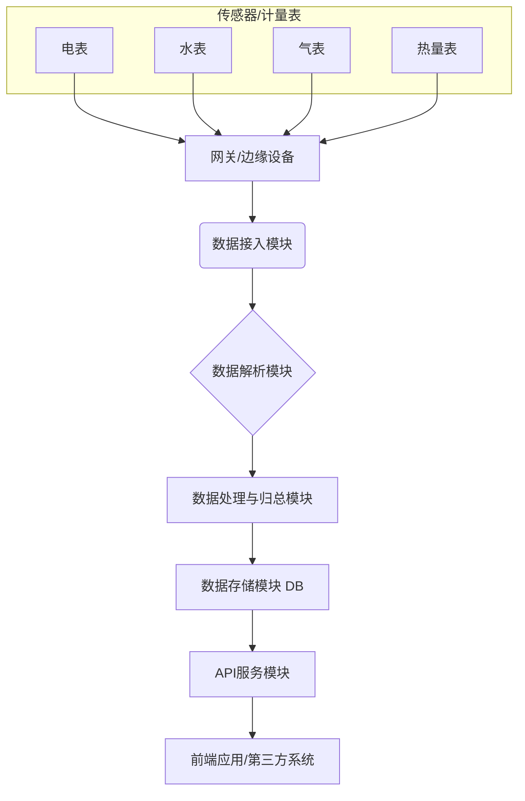

# 空港智慧空间

## 项目概述

本项目旨在构建一个空港智慧空间管理平台。核心功能是解析设备上报到 MySQL 数据库的数据，经过处理后，为前端大屏展示提供数据支持。

## 主要功能

1.  **数据接收与解析**：
    *   接收各类设备通过指定协议上报的数据。
    *   从 MySQL 数据库中读取原始设备数据。
    *   对原始数据进行解析，提取有效信息。

2.  **数据处理与分析**：
    *   对解析后的数据进行清洗、转换和聚合。
    *   根据业务需求进行数据分析和统计。
    *   生成满足前端大屏展示需求的结构化数据。

3.  **API服务**：
    *   提供稳定、高效的API接口，供前端大屏应用调用。
    *   支持实时数据推送和历史数据查询。

## 技术架构

*   **后端**：
    *   编程语言：Java 17
    *   框架：Spring Boot
    *   数据库：MySQL
    *   ORM：MyBatis-Plus
    *   工具库：Lombok
*   **前端**：[待定，根据大屏展示需求选择合适的技术栈，如 Vue.js, React, ECharts等]

## 模块划分（示意图）

## 后续工作

*   详细设计数据库表结构。
*   确定具体的技术选型。
*   搭建项目基础框架。
*   逐步实现各个功能模块。