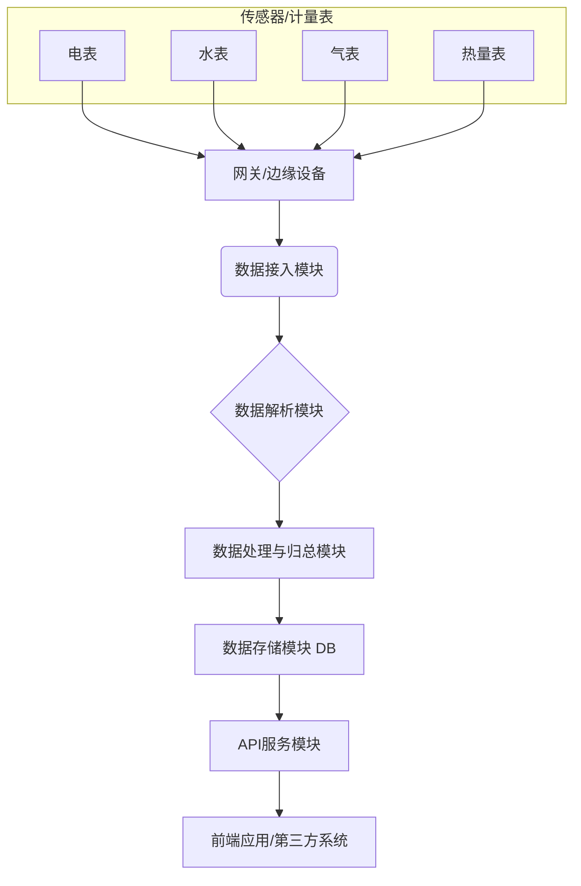

# Smart Energy Hub 🏢⚡

[](https://opensource.org/licenses/MIT)
[](https://openjdk.org/projects/jdk/17/)
[](https://spring.io/projects/spring-boot)
[](https://www.mysql.com/)
[](#)

## 📖 项目概述

Smart Energy Hub 是一个智慧能源管理平台，专为空港智慧空间设计。该平台能够接收、解析和处理各类能源设备数据，为前端大屏展示和能源管理决策提供强大的数据支持。

### ✨ 核心特性

- 🔌 **多设备支持**: 支持电表、水表、气表、热量表等多种能源计量设备
- 📊 **实时数据处理**: 实时接收和处理设备上报数据
- 🎯 **智能调度**: 内置定时任务系统，支持数据采集和分析调度
- 🚀 **高性能API**: 基于Spring Boot的RESTful API服务
- 📱 **现代化界面**: 响应式Web界面，支持移动端访问
- 🔐 **安全认证**: 集成Sa-Token权限框架，确保数据安全

## 主要功能

1.  **数据接收与解析**：
    *   接收各类设备通过指定协议上报的数据。
    *   从 MySQL 数据库中读取原始设备数据。
    *   对原始数据进行解析，提取有效信息。

2.  **数据处理与分析**：
    *   对解析后的数据进行清洗、转换和聚合。
    *   根据业务需求进行数据分析和统计。
    *   生成满足前端大屏展示需求的结构化数据。

3.  **API服务**：
    *   提供稳定、高效的API接口，供前端大屏应用调用。
    *   支持实时数据推送和历史数据查询。

## 技术架构

*   **后端**：
    *   编程语言：Java 17
    *   框架：Spring Boot
    *   数据库：MySQL
    *   ORM：MyBatis-Plus
    *   工具库：Lombok
*   **前端**：[待定，根据大屏展示需求选择合适的技术栈，如 Vue.js, React, ECharts等]

## 模块划分（示意图）



## 🚀 快速开始

### 系统要求

- Java 17+
- Maven 3.6+
- MySQL 5.7+ 或 8.0+

### 安装步骤

1. **克隆项目**
   ```bash
   git clone https://github.com/your-username/smart-energy-hub.git
   cd smart-energy-hub
   ```

2. **配置数据库**
   ```sql
   CREATE DATABASE smart_energy_hub CHARACTER SET utf8mb4 COLLATE utf8mb4_unicode_ci;
   ```

3. **配置应用**
   ```bash
   cp src/main/resources/application.properties.template src/main/resources/application.properties
   # 编辑配置文件，设置数据库连接信息
   ```

4. **运行应用**
   ```bash
   ./mvnw spring-boot:run
   ```

5. **访问应用**
   - 主页: http://localhost:8080
   - API文档: http://localhost:8080/swagger-ui.html

详细安装指南请参考 [INSTALLATION.md](INSTALLATION.md)

## 📚 文档

### 核心文档
- [安装指南](INSTALLATION.md) - 详细的安装和配置说明
- [API 文档](API.md) - 完整的 API 接口说明
- [部署指南](DEPLOYMENT.md) - 生产环境部署方案
- [架构设计](ARCHITECTURE.md) - 系统架构和技术选型

### 开发文档
- [开发指南](docs/DEVELOPMENT.md) - 开发环境配置和最佳实践
- [贡献指南](CONTRIBUTING.md) - 如何参与项目贡献

### 项目管理
- [开源准备指南](OPEN_SOURCE_PREPARATION.md) - 开源前的准备工作
- [更新日志](CHANGELOG.md) - 版本更新记录

## 🛠️ 开发

### 项目结构

```
smart-energy-hub/
├── src/main/java/com/kfblue/seh/
│   ├── controller/          # REST API控制器
│   ├── entity/             # 数据实体类
│   ├── mapper/             # MyBatis数据访问层
│   ├── service/            # 业务逻辑层
│   └── scheduler/          # 定时任务
├── src/main/resources/
│   ├── mapper/             # MyBatis XML映射文件
│   ├── static/             # 静态资源
│   ├── templates/          # Thymeleaf模板
│   └── db/migration/       # Flyway数据库迁移脚本
└── src/test/               # 测试文件
```

### 开发环境

```bash
# 启动开发模式（支持热重载）
./mvnw spring-boot:run -Dspring-boot.run.profiles=dev

# 运行测试
./mvnw test

# 构建项目
./mvnw clean package
```

## 🤝 贡献

我们欢迎所有形式的贡献！请查看 [贡献指南](CONTRIBUTING.md) 了解如何参与项目开发。

### 贡献方式

- 🐛 报告Bug
- 💡 提出新功能建议
- 📝 改进文档
- 🔧 提交代码修复
- ⭐ 给项目点星支持

## 📄 许可证

本项目采用 [MIT 许可证](LICENSE) - 详情请查看 LICENSE 文件。

## 🙏 致谢

感谢所有为这个项目做出贡献的开发者！

## 📞 联系我们

- 项目主页: [GitHub Repository](https://github.com/your-username/smart-energy-hub)
- 问题反馈: [Issues](https://github.com/your-username/smart-energy-hub/issues)
- 讨论交流: [Discussions](https://github.com/your-username/smart-energy-hub/discussions)

---

⭐ 如果这个项目对你有帮助，请给我们一个星标！